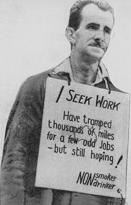

## Structures, Networks, And Organizational Culture In The Reproduction Of Inequality 
<!--.element: style="text-align:right"-->

---

### Minority Vulnerability in Privileged Occupations: Why Do African American Financial Advisors Earn Less Than Whites in a Large Financial Services Firm?

#### Bielby, William (2012) **Annals of the American Academy of Political and Social Sciences** 639 (1): 12-32

--
### The Significance of Race 

 <!--.element: style=" float: left;left:-50px;z-index: 100;position: relative;"-->
**William Julius Wilson** 

_The Declining Significance of Race_   (1978)
 <!--.element: style="float: right;right:-50px;z-index: 100;position: relative;"-->

VVV

Published in 78 but quoted as 80. Meh.

It's main claim - after the 60s, race was becoming less of a deciding factor in the life chances of black Americans than **class**.

--
<!--.slide: data-background-image="./Pictures/wilsonRaceBG.png" class="text-bg-txt"-->
### Wilson attributed the gains to these factors:

* Expansion of the Service Sector
* Opportunities in the Public Sector
* Affirmative Action and other anti-discrimination efforts

VVV

Note:

הסיבות לשיפור במצבם של האפרו-אמריקאים המשכילים:

התרחבות המגזר השירותי, הזדמנויות במגזר הציבורי וההשפעה של תוכניות נגד אפלייה.

במאמרו מ2011 הוא מכיר בחשיבות התמיכה הציבורית הנמשכת, 
or lack thereof,
 בתוכניות נגד אפלייה, אבל הוא עדיין שקט למדי לגבי טבען של ההזדמנויות והמחסומים העומדים בפני אפרו-אמריקאים בספרה התאגידית הפרטית.

--
### Precariousness opportunities  

`Collins`{Collins, Sharon. 1997. Black corporate executives: The making and breaking of a black middle class. Philadelphia, PA: Temple University Press.|1} and `Spalter-Roth and Deitch`{Spalter-Roth, Roberta, and Cynthia Deitch. 1999. 1 don't feel right sized, I feel out-of-work sized: Gender, race, ethnicity, and the unequal costs of displacement. Work and Occupations 26:446-82.|1} point to the various ways in which African Americans are **channeled** into niche fields.

`Wilson et al.`{Wilson, George, and Debra McBrier. 2005. Race and loss of privilege: African American/white differences in the determinants of layoffs from upper-tier occupations. Sociological Forum 20:301-21.| 1} {Wilson, George, and Vincent J. Roscigno. 2010. Race and downward mobility from privileged occupations: African American/white dynamics across the early work-career. Social Science Research 39:67-77.|1} developed the **Minority Vulnerability Thesis** as a framework for understanding racial inequality vis-à-vis career stability in mid- to upper-level occupations.
 

VVV

VP of the new 'urban division' - Black-ish s01e01

פיטורים ולא רק העסקה 

Meritocratic “ideologies” can mask workplace decisions that — intentionally or not — reinforce historical **patterns** of discrimination.

--
## How does the **Minority Vulnerability Thesis** apply to earning disparities
--
###### Earnings by Race and Years in Industry (2006)
<iframe width="900" height="600" frameborder="0" scrolling="no" src="https://plot.ly/~LemuelCushing/2.embed"></iframe>

VVV

*African-American financial advisors (FAs) at the firm earned “approximately one-third to 40 percent less than their white counterparts, with the size of the disparity depending on years of experience as a financial adviser in the industry.”
--
### a fertile case study for a few reasons:

* Seemingly objective determinant 

* The essential nature of inter-personal relations in this professional sphere's modus operandi

* The organizational context of highly compensated professionals 

VVV

משכורת מבוססת תפוקה

החשיבות של אמון והטבע החצרוני משהו של השוק

יחסי הכוחות היחודיים בין ההנהלה ועובדי הידע

--

### Data and methods

Expert witness reports from an employment discrimination litigation.

Two _Theories of the Case_:

##### The company
The cause of the disparities are external to the company policies - the inherent lack of social capital leads to lower earnings, in a meritocratic system where 'connections' and 'networks' are the very core of the enterprise.

--

<blockquote>
For any successful stockbroker, a majority of retail clients will almost certainly be from white households. The idea that there was a cost to African-American FAs in accessing social networks of wealthy individuals was a strong theme running through the testimony of company officials.
</blockquote>

--

##### The plaintiffs
A skewed compensation system created a self-reproducing hierarchy of unofficial cliques. 

--
Percentage of Financial Advisers (FAs) on Multiple-FA Teams

VVV 
דוגמא לאי שיוון - השתייכות לקבוצות המנהלות בתוכן כלכלת מתנות לא רשמית

--
<blockquote>
African-Americans were often socially isolated at the firm, in part because so few other African-Americans held similar positions: Only 2% of FAs at the company were African-American, and “more than 85% of the company’s offices had no African-American FAs.
</blockquote>

--

### The Matthew effect
##### "Early inequality tended to build on itself"
<blockquote style="direction: rtl !important;text-align:right !important;">
כִּי מִי אֲשֶׁר יֶשׁ־לוֹ יִנָּתֶן לוֹ וְיַעְדִּיף וּמִי אֲשֶׁר אֵין־לוֹ יֻקַּח מִמֶּנּוּ גַּם אֵת אֲשֶׁר־לוֹ
</blockquote>

— Matthew 25:29, King James Version. <!-- .element: style="text-align:right !important;"-->

--

### The issue being..

<blockquote>
A cumulative advantage system is not inherently discriminatory, so long as disparities are attributable to individual differences in productivity and have not emerged as a result of differential, discriminatory treatment by the organization. 
</blockquote>

VVV
כי אנחנו לא חס וחלילה סוציאליסטים!

--

### “opportunity hoarding” 

<blockquote style="font-size:70%;">
If members of a network acquire access to a resource that is valuable, renewable, subject to monopoly, supportive of network activities, and enhanced by the network’s modus operandi, network members regularly hoard access to the resource, creating beliefs and practices that sustain their control. If that network is categorically bounded, opportunity hoarding thereby contributes to the maintenance of categorical inequality. 
</blockquote>

VVV

מזכיר את המשחק מונופול

--

### Company attempts at addressing the inequality

* National Accounts Distribution Policy - Cannot really address the inherently unofficial
* Services to multicultural communities = Racialized jobs with constrained opportunities
* "Ambiguous, unstable, and diffuse structures of responsibility and authority" in diversity-related programs
VVV

לציין שגם זה אחרי תביעות קודמות על אפלייה מגדרית

The minority employee provides the organization with both access to and legitimacy with a minority constituency

--

* Acknowledge the potential racial bias arising from team formation processes 

<blockquote>
Company executives at GF steadfastly maintained that the process by which teams were formed was analogous to the formation of marriages among consenting adults and that it was not the company policy to force “arranged marriages
</blockquote>

VVV

הנמשל - איך לא תסתבכו בעצמכם 

קליקות מועדות לאפלייה? מי היה מאמין.
--
### Lessons 

* Proactively manage the distribution of productivity-enhancing resources so as to avoid reproducing institutionalized racism from the outside and perpetuating sources of racial bias arising from the inside.

VVV

<ul>
    <li></li>
    <li>African-Americans were often socially isolated at the firm, in part because so few other African-Americans held similar positions: Only 2% of FAs at the company were African-American, and “more than 85% of the company’s offices had no African-American FAs.” This isolation had an impact on their ability to join brokerage teams, which are crucial for gaining access to accounts, particularly in the early years of a career. While 41.6% of non-African-American financial advisers were able to join broker teams, that was true for just 11.6% of African-American brokers.</li>
    <li>Early inequality tended to build on itself: Broker teams kept key accounts to themselves, further disadvantaging those not on teams. “Because inherited accounts allow financial advisers to qualify for other resources &#8212; including additional inherited accounts &#8212; this disadvantage to [financial advisers] locked out from this kind of ‘regifting’ is cumulative.”</li>
    <li>Although the firm appointed racial minorities to lead projects when it marketed its services to multicultural communities, “this approach led to racialized jobs and constrained opportunities for African-Americans, and the company’s policies and practices along these lines were perceived as such by African-American [financial advisers].”</li>
    <li>The firm implemented of number of diversity-related programs, both company-wide and within its brokerage division, but did so “in a context of ambiguous, unstable, and diffuse structures of responsibility and authority.” The resulting dynamics supported earlier scholarship that such efforts “typically have little impact on discriminatory workplace barriers and often do more harm than good.”</li>
</ul>

The researcher notes that “African-Americans who seek to work as financial advisers may in fact encounter obstacles to acquiring wealthy clients that are not faced by their white counterparts.” One suggested remedy is for financial services firms to “proactively manage the distribution of productivity-enhancing resources so as to avoid reproducing institutionalized racism from the outside and perpetuating sources of racial bias arising from the inside.”
 ---

---
<!--.slide: data-background-image="./Pictures/1930sjobline.png" class="text-bg-bw"-->
### Double-Edged Exposure: Social Networking Sites, Job Searching and New Barriers to Employment
#### Sharone Ofer (2013) MIT Sloan School of Management. <!--.element: style="color:white !important;"-->
 <!--.element: style="width: 200px; float: right;right:-50px;bottom:0px;z-index: 100;position: relative;"-->

--
<!--.slide: data-background-image="./Pictures/1930sagency2.png" class="text-bg-bw"-->

### The rise of Social Networking Sites

<i class="fa fa-linkedin-square fa-5x fa-inverse fragment"></i> <!--.element: style="float: left;left:-50px;z-index: 100;position: relative;vertical-align: middle"-->
##### “The Internet is bringing radical   change to corporate recruiting” 
<i class="fa fa-facebook-official fa-5x fa-inverse fragment"></i> <!--.element: style="float: right;right:-50px;z-index: 100;position: relative;vertical-align: middle"-->

--
<!--.slide: data-background-image="./Pictures/1930sagency.png" class="text-bg-bw" style="text-align:center !important"-->

 
 
 
#### First wave: Online job boards 
 
 
 
#### Second wave: Online social networking sites 

VVV

שיעתוק של לוח המודעות המקומי

A recent study suggests that even when applications are made using traditional resumes, in which a job seeker provides no links to social media, up to a third of U.S. firms nonetheless search online social networks for information about the applican

--
## Early optimism

* Increased opportunities in a decreased cost
* A level playing field, where the somatic divides will be cast aside

VVV

מניפסט הסייבורג

Render the traditional socioeconomic markers invisible
--

### digital inequality: 

Job seekers’ unequal access to digital technologies and various barriers to the effective use of these digital technologies.

A dominant narrative has emerged 
#### SNS empower job seekers

VVV

ואז צמחו מחקרים שהתמקדו באי השוויון בגישה

מזכיר, אגב, את הפינימיזם הליברלי

--

### SNS as an active intermediary

* A new terrain for competition with new forms of discipline

VVV
this focus has left unanswered critical questions about the effects of SNS as a labor market intermediary for the millions of active and technologically-capable SNS users.  

הפוליטיקה של הארטיפקטים ושל התשתיתיות

--

### Method

* In-depth interviews with unemployed job seekers using SNS
* Participant-observations at workshops to train job seekers to use SNS

--

## Networking, Networking, Networking
#### The promises of the new world

* The sheer scale!  
* No matter where you are
* Every pot.. can find its lid!
* No awkward niceties - its true _gesellschaft_
* Invent yourself

VVV

The lure of the scale - everyone can! It's the land of opportunities

"tell me who your friends are.." - so choose your friends!
--

## Double edged sword

* Exposure of one's own image
* The pressure to conform and the "one profile" dillema
* Lack of control over the limits of you (synthetic) interaction
* Presentation of the self in an unknown medium
* The social-political self and the professional self

VVV

תמונה - מילולית. לדבר על אובדן האנונימיות של האינטרנט.
נראה ואינו רואה - ניתוק מההקשר בו הדמות שלך נקראת
פתח לאפלייה 

איזומורפיזם 
שוב, אובדן האנונימיות
exposure disciplines

כמו סלב - רק בלי היתרונות
הצגת העצמי והסיטואציה
קהל לא מתוכנן 
בנוסף - 
קונפורמיות מול הבלטות - אפשרויות פתוחות מול חוסר מיקוד

הפורמט הטקסטואלי והנרטיבי
אינספור המשמעויות - להזכיר את בקרדייבה

איבוד הגבולות בין האישי והמקצועי. 

--

### A Global competition - Losers will lose    

* Systematic exclusion of the _unemployed_ in favour of the _passive_ job seekers
* Homogenization of the possible 
* Dunbar number or The Monkey Sphere
* A filtering mechanism whose inner workings are nigh-transcendental
* New pressures on all workers to constantly manage their image 

VVV

fit the logic of the SNS-mediated labor market.  

One-dimensionality 

Algorithmic overlords

--

VVV

This tudy finds that while job seekers perceive certain benefits to using SNS, the use of SNS also raises difficult strategic dilemmas and obstacles for job seekers.  At core, SNS increase the exposure of job seekers, but as the data presented in this paper will show, this exposure is double-edged.  The same visibility that makes it easier for job seekers to expand their networks and for employers to find and recruit them, also makes it easier for employers to classify, rank, compare, and screen out entire categories of job seekers.  The visibility of workers on SNS has wide ranging effects, such as employers seeing pictorial images or the political activities of job seekers early in the vetting process, or for reasons that will be described in this paper, disadvantaging workers who are generalists and do not have a clear and easy-to-categorize career, and workers whose work histories are not optimally presented in a reverse chronological format.  

SNS intermediation of the labor market has two kinds of effects: 
First, as a filtering mechanism for hiring, SNS produces labor market winners and losers involving processes that often have little to do with evaluations of merit.  Second, these new filtering mechanisms also exerts new pressures on all workers, whether winners or losers as perceived through this new filter, to manage their careers, and to some extent their private lives, in particular ways that 
---
<!--.slide: data-background-image="./Pictures/lbgtq.png" class="text-bg-clr"-->
### **White normativity**: The Cultural Dimensions of Whiteness in a Racially Diverse LGBT Organization
 
 
 
 
 
#### Ward, Jane (2008) **Sociological Perspectives** 51(3): 563-586.

--
<!--.slide: data-background-image="./Pictures/1977parade.png" class="text-bg-bw"-->
### The Center

Gay Pride Parade on Hollywood Blvd. in Los Angeles, 1977

--
<!--.slide: data-background-image="./Pictures/1977parade.png" class="text-bg-bw"-->

### The Center

 <!--.element: style="mix-blend-mode: multiply;float: right;right:-50px;z-index: 100;position: relative;"-->

Establish in 1969.  
The world's largest provider of programs and services for lesbian, gay, bisexual and transgender people

--
### Normativity

“Conventional forms of association, belonging, and identification” {Halberstam, Judith. 2005. In a Queer Time and Place: Transgender Bodies, Subcultural Lives. New York: New York University Press.| 1}

#### Inclusion doesn't mean equality

* The unflinching strength of heteronormativity

VVV

the example of lesbian and gay inclusion in the unflinching strength of heteronormativity
--

### White Normativity

"Bolsters and sustains other forms of normativity, such as middle-class or heterosexual norms that emphasize the pursuit of prosperity, safety, reproduction, and respectability". 
* Ways of thinking, knowing, and doing that _naturalize whiteness_ and become **embedded** in social and institutional life.

--
### Whiteness in Organizations

* "Organizations are gendered in relation to, but also apart from, the gendered bodies that inhabit them" {Acker, Joan. 1990. “Hierarchies, Jobs, and Bodies: A Theory of Gendered Organizations.” Gender & Society 4: 139–58.| 1}

* "Norms are always racialized"

Thus - 

"even in racially diverse environments in which people of color are extended a degree of institutional power, **whiteness may still be a dominant ingredient** of the environment’s culture and a determinant of prevailing norms for communication and behavior."

VVV

Jane Ward investigates the function of race and whiteness in a racially diverse LGBT center in Los Angeles.
--

### White Hegemony 

The broader culture “trickles down” into organizations, producing whiteness as the standard by which “normal” people,ideas, and practices are often measured, even within racially diverse organizations. 

--
### The implicit color of the average gay

* The middle-class, normative gay archetype is one that is inherently white - and all the rest are immediately "**the rest**"

While half of the staff at the center identified as people of color, the organization was viewed as a “white” center by members of the larger Los Angeles LGBT community.

--

### The corporate logic

A “corporate” model of diversity which features events such as a “Diversity Day” and “Diversity Initiatives”, in which diversity isn't a byproduct true heterogeneity, but rather a **“means to an institutional end”**.

"Diversity Day drew on familiar neoliberal values, including the notion that diversity was integral to both American identity and institutional prosperity" - but as such - it became a necessity, "an obligation of all employees, and a job duty."

VVV

ההגיון התאגידי מההיבט המעמדי 

While this corporate model of diversity validates white experiences, it also validates the experience of the powerful and privileged over the oppressed. By adopting corporate practices that are associated with whiteness and the privileged middle class, the organization links itself to the “Normal Gay”

--

<blockquote>
“The Center’s” white normativity was very well shown in its ‘diversity culture,” which spoke of ideas, knowledge claims, modes of affect, vocabularies, and approaches in the ethic of the workplace
</blockquote>

--

White members proposed ideas that will “give face” to the organization, including working in neighborhoods of color and partnering with other LGBT organizations of color,

While the members of color repeated the phrase **“just do it”** or **“just make it inclusive”**
--
### An empty banner

#### Diversity alone has no **“intrinsic moral value.”**
A true rationale for diversity and inclusion is needed. 

VVV

In “White Normativity: The Cultural Dimemsions of Whiteness in a Racially Diverse LGBT Organization,” Jane Ward investigates the function of race and whiteness in a racially diverse LGBT center in Los Angeles. To Ward, . This is evident in the way the LGBT community center in Los Angeles is racialized by its constituents. While half of the staff at the center identified as people of color, the organization was viewed as a “white” center by members of the larger Los Angeles LGBT community. 
Ward argues that the perceived “whiteness” of the center was a result of an institutionalized form of white normalcy that privileged white experiences, and made staff and patrons of color as “the other”. Ward also suggests that these white normative practices are the result of (567). These events, Ward says, suggested that (573).

Diversity Day at the center was criticized as being a practice that mostly benefited white employees, validated the experiences of white employees over those of color, and made inac curate generalizations about the cultures of non-white employees (573). More critically, Ward suggests that this type of programming emphasized the need for a rationale for diversity, implying that diversity alone has no “intrinsic moral value.” While Ward does not speak at length on class specifically, the corporate model she describes carries classed connotations. While this corporate model of diversity validates white experiences, it also validates the experience of the powerful and privileged over the oppressed. By adopting corporate practices that are associated with whiteness and the privileged middle class, the organization links itself to the “Normal Gay” described by Seidman. While this Normal Gay image can be useful in legitimizing the center as an institution, it also creates class and race alienation even within organizations that are racially diverse.

Diversity tactics have become government policy in the past half-century, yet even as diverse a workplace can get, the tactics can still enable a white normative structure in organization (Ward 2008). Jane Ward (2008) depicts the white normativity of the Los Angeles Gay & Lesbian Center that overshadows the fifty-two percent staff of color. This white normative concept speaks of white ideology that conducts particular embedded norms on communication and behavior in a hierarchy of dominance (Ward 2008).  (Ward 2008). In efforts to expand diversity, members of the committee for these efforts differed by race on how to approach the issue (Ward 2008). 
 (Ward 2008). The ideas from the members of color seemed impractical by white members and were even ignored at times, while the voice with real conception of diversity should have been understood with privilege (Ward 2008). The members of color on the committee argued that the Center should already be or already is “an organization of color” (Ward 2008). Whiteness even in minority majority setting has a rude depth that needs deconstructing in these especially LGBTQ+ spaces.

despite this movement toward racial diversification, the Center still maintained a local reputation among queer people of color as “the white” LGBT organization in Los Angeles. As Jane has argued in her analysis of the Center (Ward, 2008b), to understand this apparent contradiction requires examination not only of whether – but also how and why – the Center had come to value and promote racial diversity. By most accounts, true diversity is measured by structural change, wherein organizations move beyond tokenism and include both a critical mass of people of color (and white women, queers, and the poor and working-class) at all levels of the organization. Yet as the case of the Center illustrates, structural change is not always the end of the story about intersectionality. During fieldwork and interviews, employees of color at the Center reported that although the organization's demographics and programs had changed for the better, the organization's culture was marked by an excessive focus on declaring its own racial diversity for funders and other organizations. The Center's constant promotion of its own diversity – a strategy brought to the organization by leaders (both whites and people of color) who drew on their previous corporate sector experience with diversity management and public relations – became the very practice that many employees of color identified as evidence of the “white corporate culture” of the organization. As in the corporate environment, diversification had indeed taken place at the Center, yet “diversity” (the word and the idea) had also become a normalizing force in the organization. It had become overused, empty, and “white.”

---

### Do Women Choose Different Jobs from Men? Mechanisms of Application Segregation in the Market for Managerial Workers

#### Barbulescu Roxana and Matthew Bidwell (2013) **Organization Science** 24(3):737-756

---

### Women and Malls: The Rise of Minority Women Employment Revisited

#### Marantz, Erez, Alexandra Kalev and Noah Lewin Epstein (2014) **Social Forces** 93(2):595-622
